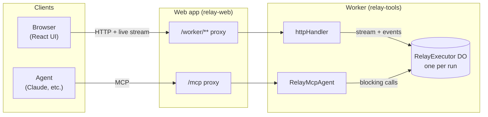
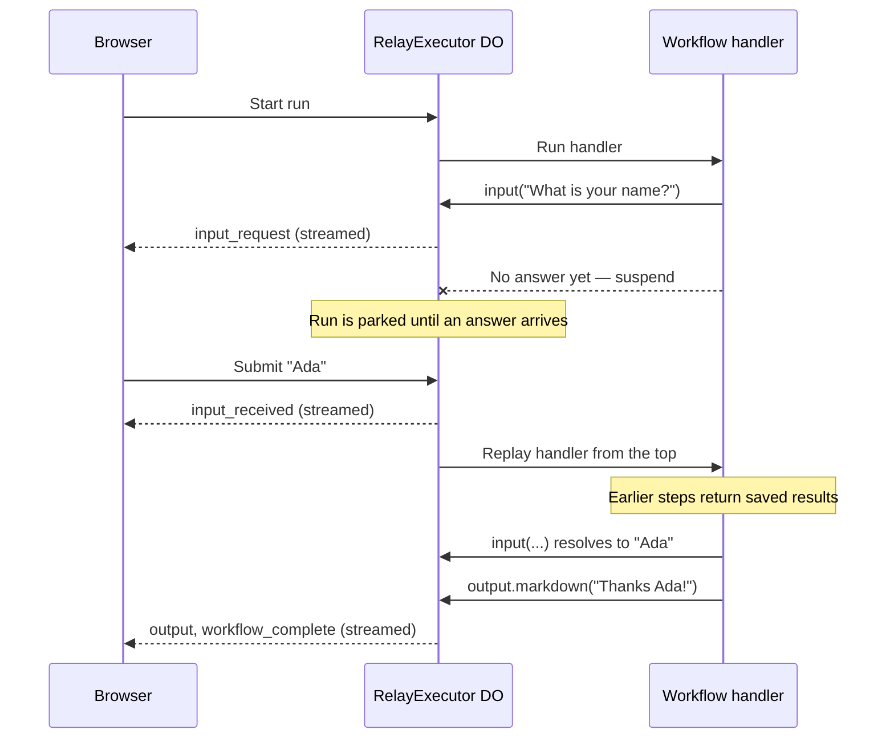

# Relay

Relay is a conceptual framework for building interactive backend functions that pause for input, show progress, and stream UI instructions to browsers and agents. It's built on top of [Cloudflare Durable Objects](https://developers.cloudflare.com/durable-objects/) and [Cloudflare Workers](https://developers.cloudflare.com/workers/) and is a spiritual successor to [Interval](https://docs.intervalkit.com/).

**⭐ Live demo: [relay-demo.philib.in](https://relay-demo.philib.in)** — run the example workflows in your browser, or connect an agent to them over MCP.

## How it works

Relay workflows are like CLI scripts: they're mostly business logic with inputs and outputs sprinkled in. They live in your codebase and you deploy them to your own infra.

Workflows are defined with `createWorkflow()`. The handler is a durable function that exposes input and output helpers. The input methods are effectively a `step.do()` + `step.waitForEvent()`; the function suspends when they're called and resumes when input is received.

```ts
// src/workflows/newsletter-signup.ts
import { createWorkflow } from "@relay-tools/sdk";

createWorkflow({
  name: "Newsletter Signup",
  handler: async ({ input, output, loading }) => {
    const name = await input.text("What is your name?");

    const { email, subscribe } = await input.group("More info", {
      email: input.text("Email"),
      subscribe: input.checkbox("Subscribe?"),
    });

    await loading("Processing...", async ({ complete }) => {
      // do async work
      complete("Done!");
    });

    await output.markdown(`Thanks ${name}!`);
  },
});
```


On startup, the SDK sends your workflow registry to the hosted Relay app where you can trigger any workflow from the browser. Input and output instructions are transmitted as JSON, and each step is written to a persistent per-run JSON stream so you get an audit trail of the entire workflow run.

But wait, there's more:

- Workflows can [define an `input` schema](./apps/examples/src/workflows/newsletter-signup.ts). You can trigger workflows with the input prefilled, or it will ask for input on the first step if not provided.
- Workflows can [register named loaders](./apps/examples/src/workflows/tables.ts) that can supply large amounts of data to tables and charts.
- Workflows can be [exposed as MCP tools](./apps/examples/src/workflows/process-refund.ts) so they can be used by agents. Instead of humans entering input in the browser, agents supply input via MCP.

## Run locally

```bash
pnpm install
pnpm dev
```

This starts two servers concurrently:

- **Worker** on `http://localhost:8787` — the Cloudflare Workers API
- **Vite** on `http://localhost:5173` — the React frontend (proxies API requests to the worker)

Open http://localhost:5173 and select a workflow in the sidebar.

## Deploy to Cloudflare

Relay consists of two apps, both deployed to [Cloudflare Workers](https://developers.cloudflare.com/workers/):

- **Worker** (`apps/examples`, deployed as `relay-tools`): hosts your tools. It runs workflows and serves the MCP endpoint.
- **Web app** (`packages/web`, deployed as `relay-web`): hosts the UI. It's a server-rendered TanStack Start app that forwards API and MCP requests to the worker server-side, so the worker URL is never exposed to browsers.

### Deploy both at once

```bash
pnpm build && pnpm deploy:all
```

`scripts/deploy.sh` deploys the worker, saves its URL on the web app as `RELAY_WORKER_URL`, deploys the web app, and then sets `RELAY_APP_URL` on the worker so agents get links to in-progress runs. `RELAY_APP_URL` defaults to the demo's public address; point it elsewhere with `APP_URL=https://your-app.example.com pnpm deploy:all`.

On a branch other than `main`, the worker is deployed as `relay-tools-<branch>`. The web app is always `relay-web`, so a branch deploy points the one web app at the branch's worker.

### Deploy each app manually

1. **Deploy the worker.** Wrangler prints its URL (e.g. `https://relay-tools.your-subdomain.workers.dev`).

   ```bash
   pnpm --filter relay-examples run deploy
   ```

2. **Deploy the web app.** Wrangler prints its URL (e.g. `https://relay-web.your-subdomain.workers.dev`).

   ```bash
   pnpm --filter @relay-tools/web run deploy
   ```

3. **Tell the web app where the worker is.** It forwards requests to this URL at runtime; nothing is baked into the build.

   ```bash
   npx wrangler --config packages/web/wrangler.jsonc secret put RELAY_WORKER_URL
   # paste: https://relay-tools.your-subdomain.workers.dev
   ```

   For local development, this is set in `packages/web/.dev.vars`.

4. **Tell the worker where the web app is,** so MCP responses can link to in-progress runs:

   ```bash
   npx wrangler --config apps/examples/wrangler.jsonc secret put RELAY_APP_URL
   # paste: your web app URL (its custom domain, if it has one)
   ```

### Custom domain (optional)

To serve the web app from your own domain, the domain's DNS must be on Cloudflare. Then go to Workers & Pages → `relay-web` → Settings → Domains & Routes → Add → Custom domain. Update `RELAY_APP_URL` on the worker to match (step 4 above, or `APP_URL` for `deploy:all`).

## MCP

Workflows that opt in with `mcp: true` in `createWorkflow()` are exposed as [MCP](https://modelcontextprotocol.io/) tools, plus a `relay_respond` tool for answering input requests. Agents can start workflows, respond to input requests, and receive structured output — all through the MCP protocol.

Relay supports two MCP transports:

- **Remote (Streamable HTTP)** — served at `/mcp` on the web app (e.g. `https://relay-web.your-subdomain.workers.dev/mcp`). The web app's home page shows this URL with setup instructions. It's only available when the web app has no login configured (no `WORKOS_CLIENT_ID`); the worker also serves `/mcp` directly, but that requires a Bearer token whenever worker auth is on.
- **Local (stdio)** — a lightweight Node.js process that proxies tool calls to the Relay API

### Connecting from Claude Desktop / claude.ai

In Settings → Connectors → Add custom connector, enter the web app's MCP URL:

```
https://relay-web.your-subdomain.workers.dev/mcp
```

### Connecting from Claude Code

```bash
claude mcp add --transport http relay https://relay-web.your-subdomain.workers.dev/mcp
```

For local development, use the stdio transport instead:

```bash
claude mcp add relay-tools -- npx tsx mcp/server.ts
```

This starts a local MCP server that connects to `http://localhost:8787` by default. To point it at a deployed worker, set the `RELAY_WORKER_URL` environment variable:

```bash
claude mcp add relay-tools -e RELAY_WORKER_URL=https://relay-tools.your-subdomain.workers.dev -- npx tsx mcp/server.ts
```

## Architecture

Every workflow run gets its own `RelayExecutor` [Durable Object](https://developers.cloudflare.com/durable-objects/), which runs the handler and stores every message the run produces. Browsers and agents are two different clients of that same object:



- **Browsers** open an NDJSON stream of the run's messages and post response over HTTP whenever the workflow asks for input.
- **Agents** call MCP tools that block until the workflow needs input or finishes, then answer with `relay_respond`.

### Pausing for input

When a workflow calls `input()`, it suspends: execution stops and nothing waits in memory until someone answers. When the answer arrives, the workflow resumes and `input()` returns the answer as if it had been waiting the whole time. Under the hood, resuming works by replay. Every primitive (`output`, `input`, `loading`, `confirm`) saves its result in the Durable Object, so the handler runs again from the top, skips past completed steps using their saved results, and continues from the `input()`.

> [!NOTE]
> This is essentially a small re-implementation of [Cloudflare Workflows](https://developers.cloudflare.com/workflows/) inside a Durable Object, with the same `step.do()` / `step.waitForEvent()` / `step.sleep()` model. Relay originally ran on Workflows, but each event took several seconds (typically 3–8s) before the workflow started running again — too slow for an interactive UI. The Durable Object executor wakes up in milliseconds.



Because the handler is replayed, it must be deterministic: the same steps must run in the same order every time.

Messages are saved in the Durable Object, and connecting to the stream replays the full history, so reloading the page picks up exactly where the run left off. When running a workflow, click the icon in the bottom-right to see the raw message stream.

See [ARCHITECTURE.md](ARCHITECTURE.md) for the full picture.
